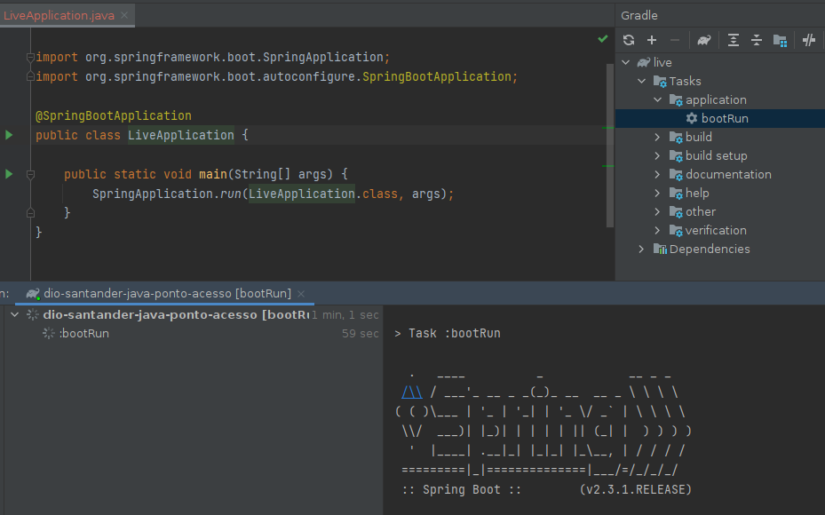
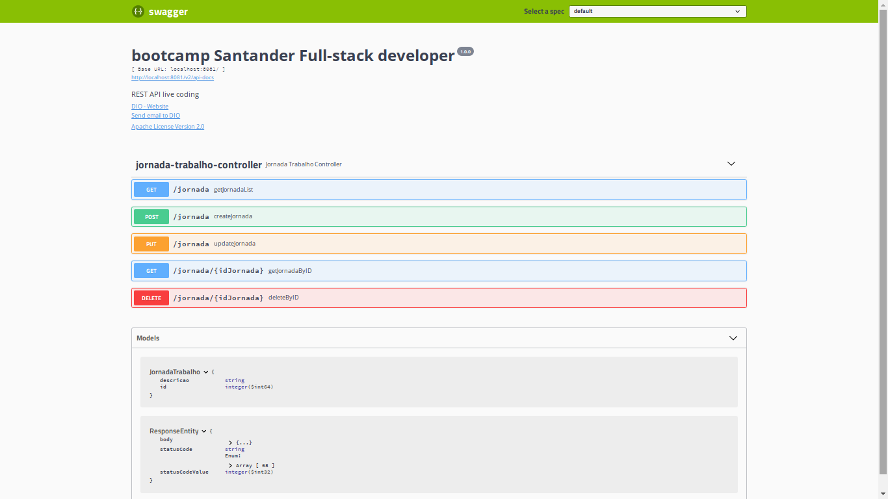
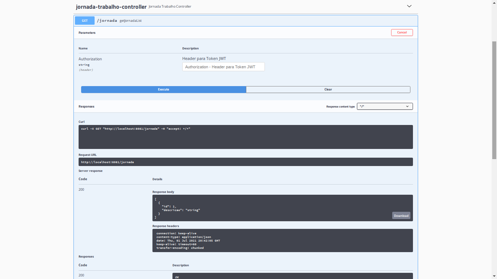

# dio-santander-java-ponto-acesso

**Santander's bootcamp**  **Digital Innovation One** .

Author: 

> API REST para controle de ponto e acesso dos usuários de uma empresa. 

### Environment

- Java JDK 11
- Spring Boot
- Spring Data JPA
- Hibernate
- Lombok
- Swagger

### Etapas para reproduzir

Execute `com.dio.live.LiveApplication` class

`http://localhost:8081/swagger-ui.html`

